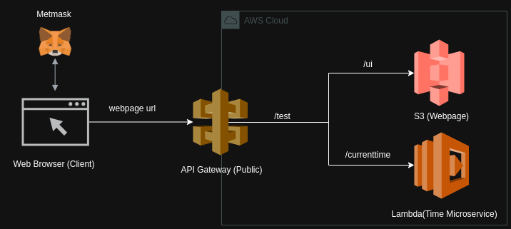

# Blockchain Time Service

## Overview
This project demonstrates a seamless integration of Ethereum blockchain payments with a cloud-hosted microservice, providing the current time. Users interact with the service using blockchain for payment.

## Specifications
- The microservice, hosted on the AWS cloud, echoes back the current time.
- Payment is handled through a smart contract on the Ethereum Sepolia testnet.
- The service costs one cent USDC per usage, charged via the smart contract.

## System Architecture
The system's architecture comprises several key components:
- **Web Browser (Client):** Allows the user to access the web UI to interact with the service.
- **MetaMask:** Facilitates Ethereum transactions and interacts with the user's wallet.
- **AWS API Gateway (Public):** A managed service that handles the HTTP requests.
- **AWS Lambda (Time Microservice):** Executes the function to fetch and return the current time.
- **Amazon S3 (Webpage Hosting):** Hosts the web UI, allowing users to initiate service requests.
- **Ethereum Sepolia Testnet (Smart Contract):** Processes payments and handles the transaction logic.

### Architecture Diagram


## Flow of Control
Users make a request through the UI to view the current time. They authorize the payment via MetaMask, which prepares to interact with the smart contract. Upon payment authorization, the UI sends the request to the AWS API Gateway. The API Gateway forwards the request to the Lambda function. Lambda processes the request, obtaining the current time. In parallel, the smart contract on the Sepolia testnet manages the payment transaction. The Lambda function sends the time data back through the API Gateway. ...

## Deliverables
- **Architecture Diagram:** Visual representation of the system's components and their interconnectivity.
- **Microservice:** AWS Lambda function to provide the current time.
- **User Interface:** Web UI hosted on Amazon S3 for service interaction.
- **Payment Smart Contract:** Deployed on Ethereum's Sepolia testnet.

## Smart Contract Overview


The smart contract *TimeCollector* is deployed on the Ethereum Sepolia testnet and interacts with USDC tokens.

```solidity
// SPDX-License-Identifier: MIT
pragma solidity ^0.8.20;

import "@openzeppelin/contracts/token/ERC20/IERC20.sol";

contract TimeCollector {
    event TimeRequested(address indexed sender, uint256 timestamp);
    IERC20 public usdc;

    uint256 public constant FEE = 10000; // 1 cent in USDC smallest units

    constructor(address _usdcAddress) {
        usdc = IERC20(_usdcAddress);
    }

    function collectTime() public {
        require(usdc.transferFrom(msg.sender, address(this), FEE), "Payment failed");
        emit TimeRequested(msg.sender, block.timestamp);
    }
}
```
- **Token Interaction:** It interacts with USDC tokens, a stablecoin pegged to the US dollar, using the ERC-20 standard (IERC20). This interaction ensures a stable and predictable transaction cost.

- **Functionality:**
    - Collect Fee: Users pay a fee of one cent in USDC to retrieve the current time. This fee is automatically transferred from the user's wallet to the contract.
    - Log Transactions: Each successful payment triggers an event, logging the requester's address and the time of the transaction, enhancing transparency and auditability.

## Access Requirements
To access and use the time service application, you will need:
- MetaMask: A browser extension or mobile app connected to the [Ethereum Sepolia testnet](https://sepolia.etherscan.io/).
- USDC Tokens: A balance of [USDC tokens](https://sepolia.etherscan.io/token/0x1c7D4B196Cb0C7B01d743Fbc6116a902379C7238) on the Sepolia testnet in your MetaMask wallet to cover the service fees. 
- Web Browser: A compatible web browser like Chrome, Firefox, or Brave with the MetaMask extension installed.

## Getting Started
- Navigate to web UI on [https://jmaxajuyn6.execute-api.us-east-1.amazonaws.com/test/ui](https://jmaxajuyn6.execute-api.us-east-1.amazonaws.com/test/ui).
- Follow the instructions and interact with the USDC smart contract on the Sepolia testnet.


